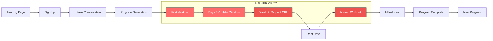

# User Journey Intervention Map

**Document ID:** 236-journey-map
**Purpose:** Identify WHERE in the baisics user journey psychological interventions would have maximum impact
**Last Updated:** January 2026

---

## Table of Contents

1. [Journey Overview Diagram](#journey-overview-diagram)
2. [Key Moments Analysis](#key-moments-analysis)
3. [Intervention Priority Matrix](#intervention-priority-matrix)
4. [Detailed Moment Breakdowns](#detailed-moment-breakdowns)
5. [Gap Analysis: What's Missing](#gap-analysis-whats-missing)

---

## Journey Overview Diagram

```
┌─────────────────────────────────────────────────────────────────────────────────────────┐
│                           BAISICS USER JOURNEY MAP                                       │
│                     (with psychological intervention points)                             │
└─────────────────────────────────────────────────────────────────────────────────────────┘

ACQUISITION                 ACTIVATION                    RETENTION                RESURRECTION
    │                           │                             │                         │
    ▼                           ▼                             ▼                         ▼
┌─────────┐    ┌─────────┐    ┌─────────┐    ┌─────────┐    ┌─────────┐    ┌─────────┐
│ Landing │───▶│ Sign Up │───▶│ Intake  │───▶│ Program │───▶│ First   │───▶│ Day 3-7 │
│  Page   │    │ (Magic  │    │ (Conv)  │    │  Gen    │    │ Workout │    │ (Habit  │
│         │    │  Link)  │    │         │    │         │    │         │    │ Window) │
└─────────┘    └─────────┘    └─────────┘    └─────────┘    └─────────┘    └─────────┘
    ⚡              ○              ○              ⚡              ⚡⚡            ⚡⚡⚡

    ┌─────────┐    ┌─────────┐    ┌─────────┐    ┌─────────┐    ┌─────────┐
───▶│ Week 2  │───▶│ Rest    │───▶│ Missed  │───▶│ Mile-   │───▶│ Program │
    │(Dropout │    │ Days    │    │ Workout │    │ stones  │    │Complete │
    │  Cliff) │    │         │    │         │    │         │    │         │
    └─────────┘    └─────────┘    └─────────┘    └─────────┘    └─────────┘
       ⚡⚡⚡           ⚡⚡           ⚡⚡⚡           ⚡              ⚡⚡

LEGEND:
  ⚡   = Low dropout risk, low intervention priority
  ⚡⚡  = Medium dropout risk, medium priority
  ⚡⚡⚡ = HIGH dropout risk, HIGH intervention priority
  ○   = Currently well-handled
```

### Mermaid Version (for tooling)



---

## Key Moments Analysis

| Moment | Current UX | Dropout Risk | Psychological Opportunity | Intervention Ideas |
|--------|-----------|--------------|---------------------------|-------------------|
| **First Visit** | Landing with personas, examples | Low | Identity resonance, commitment | Pre-commitment device, identity quiz |
| **Program Generation** | Streaming progress, animated | Low | Anticipation, ownership | Add commitment language, personalization |
| **First Workout** | Standard tracking UI | **HIGH** | Foundation for habit, early win | Simplified first session, celebration, follow-up |
| **Days 3-7** | No special handling | **HIGH** | Habit formation window | Streak activation, daily nudges, micro-commitments |
| **Week 2 (Dropout Cliff)** | No special handling | **CRITICAL** | Make-or-break moment | Check-in intervention, recommitment prompt |
| **Rest Days** | Implicit only | **HIGH** | Rest anxiety, streak breaking | Explicit rest celebration, "active recovery" framing |
| **Missed Workout** | Silent failure | **CRITICAL** | Shame spiral, abandonment | Recovery path, streak protection, reframe |
| **Milestones** | Achievement cards exist | Low | Reinforcement, identity | Expand variety, add lifetime milestones |
| **Program Complete** | Basic completion flow | Medium | Transition anxiety, momentum | Strong graduation ceremony, clear next steps |

---

## Intervention Priority Matrix

```
                         INTERVENTION IMPACT (HIGH)
                                    │
                                    │
              Week 2         ●      │      ●  Missed Workout
              Dropout               │         Recovery
              Cliff                 │
                                    │
                    Days 3-7  ●     │     ●  First Workout
                    Habit Window    │        Celebration
                                    │
    ───────────────────────────────┼───────────────────────────
    EASY TO IMPLEMENT              │           HARD TO IMPLEMENT
                                    │
                         Rest  ●    │    ●  Streak System
                         Days       │       (full implementation)
                                    │
              Milestones      ●     │     ●  Program Complete
              (expand)              │        Graduation
                                    │
                                    │
                         INTERVENTION IMPACT (LOW)
```

**Recommended Priority Order:**
1. First Workout Celebration (high impact, moderate effort)
2. Days 3-7 Streak Activation (high impact, moderate effort)
3. Week 2 Intervention (critical moment, requires design)
4. Missed Workout Recovery (critical, complex)
5. Rest Day Framing (quick win, high ROI)
6. Milestone Expansion (enhancement, lower priority)
7. Program Complete Graduation (deferred, complex)

---

## Detailed Moment Breakdowns

### 1. First Visit (Landing Page)

**Current UX:**
- Three relatable personas (Sarah comeback, Marcus intermediate, Elena busy parent)
- Sample programs with real workout examples
- Pricing tiers displayed
- Sign up via magic link (no password friction)

**Dropout Risk:** Low (1/5)
- Users arriving have intent
- Friction-free signup reduces abandonment

**Psychological Opportunity:**
- **Identity Resonance:** Personas prime "I'm like them" thinking
- **Implementation Intention:** Opportunity to ask "when will you work out?"
- **Public Commitment:** Social sharing of goals increases follow-through

**Intervention Ideas:**
| Idea | Principle | Effort | Impact |
|------|-----------|--------|--------|
| Add "I'm committing to..." statement during signup | Commitment device | Small | Medium |
| Let user select which persona they identify with | Identity-based habits | Small | Medium |
| Ask preferred workout days during intake | Implementation intentions | Small | High |
| Show "Join 847 people who started this week" | Social proof | Small | Low |

---

### 2. Program Generation

**Current UX:**
- Streaming progress with percentage (0-100%)
- Animated phase cards appearing as generated
- "Analyzing your goals" → "Designing structure" → "Selecting exercises" → "Calculating nutrition"
- Success screen with full program

**Dropout Risk:** Low (1/5)
- Users are invested at this point
- Progress animation maintains engagement
- Anticipation builds excitement

**Psychological Opportunity:**
- **Ownership Effect:** User feels program is "theirs" (personalized)
- **Peak-End Rule:** End of generation = memorable moment
- **Commitment Escalation:** Build verbal commitment before first workout

**Intervention Ideas:**
| Idea | Principle | Effort | Impact |
|------|-----------|--------|--------|
| Add "Your program is ready! When's your first workout?" prompt | Implementation intentions | Small | High |
| Show "Designed specifically for [name]" messaging | IKEA effect / ownership | Tiny | Medium |
| Add brief preview of first workout | Anticipation, reduce uncertainty | Medium | Medium |
| Celebration animation on completion (confetti) | Positive reinforcement | Small | Low |

---

### 3. First Workout ⚡⚡

**Current UX:**
- Standard workout tracking interface
- Progress bar at top (X of Y sets complete)
- Rest timer with auto-start option
- Exercise instructions and form links
- Achievement card on completion

**Dropout Risk:** HIGH (4/5)
- Moment of truth: Does reality match expectations?
- Overwhelm risk if program is complex
- UX learning curve
- No social accountability

**Psychological Opportunity:**
- **Competence Building (SDT):** User needs to feel capable
- **Variable Reward:** First completion = first dopamine hit
- **Identity Formation:** "I'm someone who works out"

**Intervention Ideas:**
| Idea | Principle | Effort | Impact |
|------|-----------|--------|--------|
| Simplified "First Workout Mode" with fewer exercises | Reduce overwhelm | Medium | HIGH |
| Extra celebration animation on first completion | Variable reward, peak-end | Small | HIGH |
| "Day 1 of your journey" framing | Identity-based habits | Tiny | Medium |
| Proactive notification 24h later checking in | Follow-up, commitment | Medium | High |
| Show abbreviated version of exercises (3-4 max) | Reduce friction | Medium | HIGH |
| Pop-up: "How did that feel?" with emoji rating | Reflection, engagement | Small | Medium |
| Auto-share prompt to Twitter/friends | Public commitment | Small | Medium |

---

### 4. Days 3-7: Habit Formation Window ⚡⚡⚡

**Current UX:**
- No special handling
- Streak badge exists but passive
- No proactive outreach
- User must self-motivate to return

**Dropout Risk:** CRITICAL (5/5)
- Research shows habits form in first week
- Each day missed increases dropout probability exponentially
- No system currently "pulls" user back

**Psychological Opportunity:**
- **Habit Stacking:** Connect workout to existing routine
- **Streak Psychology:** Activate "don't break the chain" motivation
- **Implementation Intentions:** Reinforce when/where decisions

**Intervention Ideas:**
| Idea | Principle | Effort | Impact |
|------|-----------|--------|--------|
| Day 2: "Workout 2 is ready!" notification | Pull back, momentum | Small | HIGH |
| Day 3: Streak badge becomes prominent (fire animation) | Variable reward | Medium | HIGH |
| Day 4-5: "You're building a habit!" messaging | Identity reinforcement | Small | Medium |
| Day 7: "1 Week Champion" achievement | Milestone celebration | Small | HIGH |
| Daily micro-commitment: "Planning to workout today? Yes/No" | Commitment device | Medium | HIGH |
| Show "3/4 workouts this week" progress ring | Visual progress | Medium | HIGH |
| Morning notification: "Your [muscles] are ready for today" | Anticipation, personalization | Medium | Medium |

---

### 5. Week 2: The Dropout Cliff ⚡⚡⚡

**Current UX:**
- No special handling
- Check-in exists but may not be triggered
- No intervention for declining engagement
- Silent failure path

**Dropout Risk:** CRITICAL (5/5)
- Industry data: 50%+ users quit by week 2
- Initial motivation fades
- "I'll get back to it" procrastination
- Results not yet visible

**Psychological Opportunity:**
- **Recommitment Opportunity:** Explicit re-choosing
- **Reflection:** "Why did you start?" reminder
- **Adjustment:** Maybe program needs tweaking
- **Social Accountability:** Buddy system activation

**Intervention Ideas:**
| Idea | Principle | Effort | Impact |
|------|-----------|--------|--------|
| Week 2 check-in: "How's it going? Honestly." | Reflection, adjustment | Medium | HIGH |
| Show "15% of your program complete" milestone | Progress visibility | Small | Medium |
| "Remember why you started" quote/goal reminder | Goal recommitment | Small | HIGH |
| Offer program adjustment: "Too hard? Let's adjust" | Autonomy, reduce shame | Medium | HIGH |
| If 0 workouts logged: "Getting started is the hardest part" recovery message | Reframe failure | Medium | CRITICAL |
| Introduce "workout buddy" pairing feature | Social accountability | Large | HIGH |
| Send "You got this" message from "coach" | External motivation | Small | Medium |

---

### 6. Rest Days ⚡⚡

**Current UX:**
- **NO explicit rest day handling**
- Rest is implicit (program has 3-5 days/week, rest is gap)
- User may feel guilty for not working out
- Streak logic unclear on rest days

**Dropout Risk:** HIGH (4/5)
- "Rest day" feels like "failure day" without framing
- Streak anxiety on legitimate rest
- No guidance on what to do instead

**Psychological Opportunity:**
- **Reframe Rest as Active:** Rest = muscle building time
- **Maintain Engagement:** Stay connected without workout
- **Education:** Teach why rest matters

**Intervention Ideas:**
| Idea | Principle | Effort | Impact |
|------|-----------|--------|--------|
| "Rest Day" label on scheduled off-days | Explicit permission | Small | HIGH |
| "Your muscles are growing today" messaging | Reframe as progress | Small | HIGH |
| Active recovery suggestions (walk, stretch) | Engagement without pressure | Medium | Medium |
| "Rest Day Check-in" single question prompt | Stay connected | Small | HIGH |
| Different dashboard color/UI on rest days | Visual distinction | Medium | Medium |
| Streak protection: rest days don't break streak | Loss aversion protection | Medium | CRITICAL |
| Educational micro-content: "Why rest matters" | Autonomy/education (Noom-style) | Small | Medium |

---

### 7. Missed Workout ⚡⚡⚡

**Current UX:**
- **Silent failure** - no acknowledgment
- User simply doesn't log workout
- Next login shows same dashboard
- No recovery path offered
- Shame accumulates silently

**Dropout Risk:** CRITICAL (5/5)
- Shame spiral leads to avoidance
- "All or nothing" thinking kicks in
- Each missed day lowers return probability
- Eventually user ghosts app entirely

**Psychological Opportunity:**
- **Shame Reduction:** Normalize missing workouts
- **Recovery Path:** Clear way back
- **Reframe:** One missed workout ≠ failure
- **Streak Protection:** Duolingo "Streak Freeze" concept

**Intervention Ideas:**
| Idea | Principle | Effort | Impact |
|------|-----------|--------|--------|
| "Life happens" messaging when detecting gap | Shame reduction | Small | HIGH |
| Streak Freeze: Allow 1 protected miss | Loss aversion management | Medium | CRITICAL |
| "Pick up where you left off" button | Clear recovery path | Small | HIGH |
| Show "3 of 4 workouts this week" (not 0 streak) | Partial credit framing | Small | HIGH |
| Proactive notification: "Ready to get back?" | Pull back, non-judgmental | Medium | HIGH |
| Offer shorter "comeback" workout | Reduce re-entry friction | Medium | HIGH |
| "You're still ahead of people who didn't start" | Reframe perspective | Small | Medium |
| Delete "streak" concept, use "total workouts" lifetime | Remove loss potential | Large | HIGH |

---

### 8. Milestones

**Current UX:**
- Achievement types defined:
  - `first_workout` 🎯
  - `week_complete` 📅
  - `phase_complete` 🏆
  - `program_complete` 🎉
  - `streak_7` 🔥 / `streak_30` 💪
  - `weight_goal` ⚖️
  - `strength_pr` 🏋️
- Beautiful share cards with gradients
- Social sharing to Twitter/native

**Dropout Risk:** Low (2/5)
- Milestones help retention
- Currently underutilized

**Psychological Opportunity:**
- **Variable Rewards:** Surprise achievements
- **Identity Building:** "I'm someone with 50 workouts"
- **Social Proof:** Shareable accomplishments
- **Lifetime Value:** Progress never lost (Apple approach)

**Intervention Ideas:**
| Idea | Principle | Effort | Impact |
|------|-----------|--------|--------|
| Add lifetime milestones: 25, 50, 100, 365, 500 workouts | Progress never lost | Small | HIGH |
| Surprise achievements: "Leg Day Legend" (5 leg days) | Variable reward | Medium | HIGH |
| Monthly challenges: "Complete 12 workouts in January" | Time-bound commitment | Large | Medium |
| Personal bests tracking (volume, weight) | Strength PR expansion | Medium | Medium |
| "Local Legend" concept: "Most consistent at your gym" | Social/competitive | Large | Medium |
| Shareable milestone cards with stats | Social reinforcement | Small | Medium |
| Add sound effects for achievements | Multi-sensory reward | Small | Low |

---

### 9. Program Complete ⚡⚡

**Current UX:**
- Achievement card for "Program Complete"
- Option to create new program
- Program marked as complete in list
- Basic flow

**Dropout Risk:** Medium (3/5)
- Transition point where users might leave
- "What now?" uncertainty
- Momentum could be lost

**Psychological Opportunity:**
- **Graduation Ceremony:** Mark accomplishment significantly
- **Identity Reinforcement:** "You're someone who finishes programs"
- **Clear Next Step:** Reduce uncertainty
- **Upsell Moment:** Natural point for premium features

**Intervention Ideas:**
| Idea | Principle | Effort | Impact |
|------|-----------|--------|--------|
| Full "graduation" screen with confetti, stats summary | Peak-end rule | Medium | HIGH |
| Certificate/badge shareable to social | Identity, social proof | Medium | HIGH |
| "What you accomplished" comparison: Week 1 vs now | Progress visualization | Medium | HIGH |
| Pre-generated "Next Program" ready to claim | Reduce decision friction | Medium | HIGH |
| Survey: "What's next for you?" to inform program | Autonomy, investment | Small | Medium |
| Send email celebrating completion | External reinforcement | Small | Medium |
| Special achievement: "Program Finisher" (lifetime) | Identity building | Small | Medium |

---

## Gap Analysis: What's Missing

### Critical Gaps (Must Address)

| Gap | Current State | Business Risk | Recommended Action |
|-----|---------------|---------------|-------------------|
| **No Missed Workout Recovery** | Silent failure | Users ghost app | Implement "Life happens" messaging + recovery path |
| **No Rest Day Handling** | Implicit only | Rest anxiety, guilt | Add explicit rest day framing and streak protection |
| **No Week 2 Intervention** | Silent churn | 50%+ dropout | Add proactive check-in and recommitment flow |
| **No Habit Window Nurturing** | Passive streak badge | Habits don't form | Active Days 3-7 engagement campaign |

### Important Gaps (Should Address)

| Gap | Current State | Business Risk | Recommended Action |
|-----|---------------|---------------|-------------------|
| **First Workout Not Special** | Standard UI | Overwhelming | Create "First Workout Mode" with simplification |
| **Lifetime Milestones Missing** | Only streak-based | Progress can be lost | Add 25/50/100/365/500 workout milestones |
| **Program Complete Underwhelming** | Basic flow | Churn at transition | Create graduation ceremony flow |

### Nice-to-Have Gaps (Could Address)

| Gap | Current State | Business Risk | Recommended Action |
|-----|---------------|---------------|-------------------|
| **No Social Features** | Twitter share only | Limited accountability | Consider buddy system or groups |
| **No Variable Rewards** | Predictable achievements | Engagement plateaus | Add surprise achievements |
| **No Educational Content** | Workout-only | Autonomy not built | Noom-style micro-lessons on "why" |

---

## Summary: Top 5 Intervention Points

1. **Days 3-7 Habit Window** - Active engagement to form habits
2. **Week 2 Dropout Cliff** - Proactive check-in and recommitment
3. **Missed Workout Recovery** - Shame reduction and clear return path
4. **Rest Day Framing** - Explicit permission and streak protection
5. **First Workout Celebration** - Make first success memorable

---

## Related Documents

- [236-psych-foundations.md](./236-psych-foundations.md) - Psychological principles
- [236-competitor-duolingo.md](./236-competitor-duolingo.md) - Duolingo analysis (streaks, notifications)
- [236-competitor-strava.md](./236-competitor-strava.md) - Strava analysis (social, kudos)
- [236-competitor-noom.md](./236-competitor-noom.md) - Noom analysis (education, behavior chains)
- [236-competitor-apple-fitness.md](./236-competitor-apple-fitness.md) - Apple analysis (rings, simplicity)

---

## Appendix: Current UX Screenshots (ASCII Representations)

### Current Workout Screen
```
┌─────────────────────────────────────────┐
│  Progress: 3 of 12 sets   ████░░░ 25%   │
├─────────────────────────────────────────┤
│                                         │
│  Exercise 2 of 5                        │
│  ┌─────────────────────────────────────┐│
│  │ BENCH PRESS                         ││
│  │ 3 sets × 8 reps                     ││
│  │ [Swap] [Ask] [Form]                 ││
│  └─────────────────────────────────────┘│
│                                         │
│  Set Progress: [✓1] [●2] [○3]          │
│                                         │
│  ┌─────────────────────────────────────┐│
│  │ Weight: [135] lbs                   ││
│  │ Reps:   [8]                         ││
│  │ Notes:  [____________]              ││
│  │                                     ││
│  │ Previous: 130 lbs                   ││
│  │                                     ││
│  │      [Complete Set]                 ││
│  └─────────────────────────────────────┘│
│                                         │
│  Rest Timer: 2:30  [▶] [↺]             │
│  ═══════════════░░░░░░░░░░░            │
│                                         │
│  [← Previous]            [Next →]       │
│                                         │
│  Quick Nav: [✓1] [●2] [○3] [○4] [○5]   │
└─────────────────────────────────────────┘
```

### Proposed: First Workout Mode
```
┌─────────────────────────────────────────┐
│  🎯 Your First Workout!                 │
│  ─────────────────────────────────────  │
│  Just 3 exercises today to get started  │
├─────────────────────────────────────────┤
│                                         │
│  Progress: 1 of 3 exercises             │
│  ████████░░░░░░░░░░░░░░░░░░ 33%        │
│                                         │
│  ┌─────────────────────────────────────┐│
│  │ 1. GOBLET SQUAT                     ││
│  │    • 2 sets × 10 reps               ││
│  │    • Watch form video first? [▶]    ││
│  │    • Don't worry about weight—      ││
│  │      focus on the movement          ││
│  └─────────────────────────────────────┘│
│                                         │
│  💡 Tip: Your first workout is about   │
│     learning, not lifting heavy.        │
│                                         │
│        [Start Exercise →]               │
│                                         │
└─────────────────────────────────────────┘
```

### Proposed: Rest Day Screen
```
┌─────────────────────────────────────────┐
│  🌙 Rest Day                            │
│  ─────────────────────────────────────  │
│  Your muscles are growing right now.    │
├─────────────────────────────────────────┤
│                                         │
│  This Week: [✓M] [✓W] [○F]              │
│             2 of 3 workouts done        │
│                                         │
│  ┌─────────────────────────────────────┐│
│  │ 💪 Why Rest Matters                 ││
│  │                                     ││
│  │ Muscle growth happens during rest,  ││
│  │ not during workouts. Taking today   ││
│  │ off is part of getting stronger.    ││
│  └─────────────────────────────────────┘│
│                                         │
│  Optional Active Recovery:              │
│  • 10-min walk                          │
│  • Light stretching                     │
│  • Foam rolling                         │
│                                         │
│  Next workout: Friday (Legs & Core)     │
│                                         │
│        [Quick Check-in]                 │
│                                         │
└─────────────────────────────────────────┘
```

### Proposed: Missed Workout Recovery
```
┌─────────────────────────────────────────┐
│  👋 Welcome Back                        │
│  ─────────────────────────────────────  │
│  Life happens. Let's pick up where      │
│  you left off.                          │
├─────────────────────────────────────────┤
│                                         │
│  ┌─────────────────────────────────────┐│
│  │ Your Progress is Safe               ││
│  │                                     ││
│  │ ✓ 8 workouts completed              ││
│  │ ✓ Week 3 of your program            ││
│  │ ✓ You're still ahead of most people ││
│  └─────────────────────────────────────┘│
│                                         │
│  Ready to get back?                     │
│                                         │
│  [Full Workout] - 45 min                │
│                                         │
│  [Quick Comeback] - 20 min              │
│  Just 3 exercises to rebuild momentum   │
│                                         │
│  [Not Today - Remind Me Tomorrow]       │
│                                         │
└─────────────────────────────────────────┘
```

---

*Document created for baisics research spike #236*
